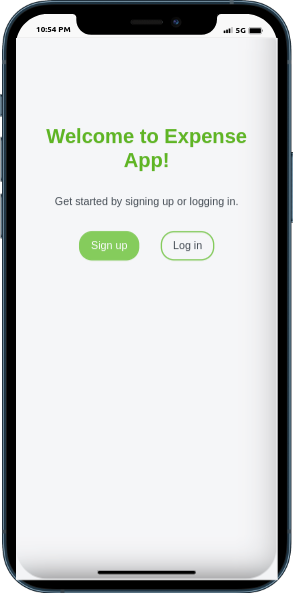

<a name="readme-top"></a>

# 📗 Table of Contents

- [📗 Table of Contents](#-table-of-contents)
- [📖 ExpenseApp ](#-expenseapp-)
  - [🛠 Built With ](#-built-with-)
    - [Tech Stack ](#tech-stack-)
    - [Key Features ](#key-features-)
  - [🚀 Live Demo ](#-live-demo-)
  - [Preview](#preview)
  - [💻 Getting Started ](#-getting-started-)
    - [Prerequisites](#prerequisites)
    - [Setup](#setup)
    - [Install](#install)
    - [Usage](#usage)
    - [Run tests](#run-tests)
  - [👥 Author ](#-author-)
  - [🔭 Future Features ](#-future-features-)
  - [🤝 Contributing ](#-contributing-)
  - [⭐️ Show your support ](#️-show-your-support-)
  - [🙏 Acknowledgments ](#-acknowledgments-)
  - [📝 License ](#-license-)
<!-- - [🔭 Future Features](#future-features) -->
- [🤝 Contributing](#contributing)
- [⭐️ Show your support](#support)
- [🙏 Acknowledgements](#acknowledgements)
<!-- - [❓ FAQ](#faq) -->
- [📝 License](#license)

# 📖 ExpenseApp <a name="about-project"></a>

Expense App is an expenses management app created using Ruby on Rails. It allows a user to create new categories and create new expenses for each category thus you have a list of transactions associated with a category.

## 🛠 Built With <a name="built-with"></a>

### Tech Stack <a name="tech-stack"></a>

  <ul>
    <li><a href="https://rubyonrails.org/">Rails</a></li>
    <li><a href="https://www.postgresql.org/">PostgreSQL</a></li>
    <li><a href="https://www.tailwindcss.com/">Tailwind CSS</a></li>
    <li><a href="https://developer.mozilla.org/en-US/docs/Web/JavaScript">JavaScript</a></li>
  </ul>

### Key Features <a name="key-features"></a>

- User Registration.
- User login.
- Create Category: a user can create a category for his expenses.
- Create transaction(expense): a user can create a transaction that belongs to a specific category.

## Preview



## 💻 Getting Started <a name="getting-started"></a>

To get a local copy up and running, follow these steps.

### Prerequisites

In order to run this project you need:

- IDE or code editor: **VsCode, atom, sublime**...
- To have [Ruby](https://www.ruby-lang.org/en/) and [Git](https://git-scm.com/) installed on your system.
- To have [Node.js](https://nodejs.org/) installed on your system.

After installing Ruby, run the following command to install rails.-

```sh
 gem install rails
```

### Setup

Clone this project on your local machine using the following command in your terminal:

```sh
  git clone https://github.com/ginabeki/Budget-app.git
```

### Install

Run the following command to install all project's dependencies:

```sh
  cd Budget-app
  bundle install
  node install
```

### Usage

To run the project, execute the following command:

Example command:

```sh
  rails server
```

OR

```sh
  rails s
```

### Run tests

To run tests, run the following command:

Example command:

```sh
  gem install rails rspec
  rspec ./spec/models/
```

## 👥 Author <a name="authors"></a>

👤 **Gina Beki**

- GitHub: [@ginabeki](https://github.com/ginabeki)
- Twitter: [@gina](https://twitter.com/ginabeki)
- LinkedIn: [@ginabeki](https://www.linkedin.com/in/ginabeki/)

<!-- ## 🔭 Future Features <a name="future-features"></a>

- [ ] **Add GUI** -->
## 🔭 Future Features <a name="future-features"></a>

- **Deploy the project and make it available for every one.**
- **Advance the UI**

## 🤝 Contributing <a name="contributing"></a>

Contributions, issues, and feature requests are welcome!

Feel free to check the [issues page](https://github.com/ginabeki/Budget-app/issues).

## ⭐️ Show your support <a name="support"></a>

If you like this project, kindly give it a star ⭐️

## 🙏 Acknowledgments <a name="acknowledgements"></a>

- Microverse😉
- Ruby on Rails Documentation🙃
- Huge appreciation to [Gregoire Vella](https://www.behance.net/gregoirevella) for providing design system guidelines🙃

## 📝 License <a name="license"></a>

This project is [MIT](./LICENSE) licensed.

<p align="right">(<a href="#readme-top">back to top</a>)</p>
